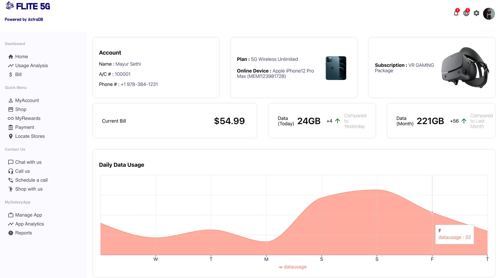
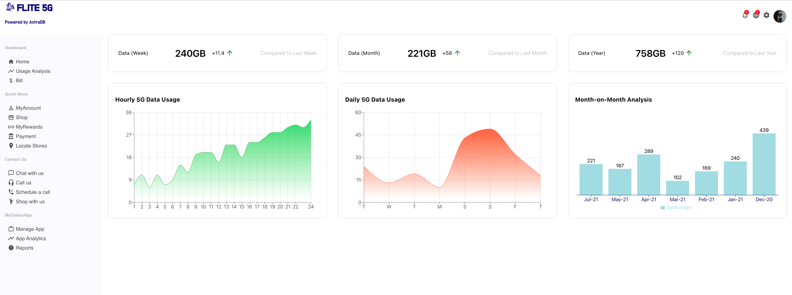
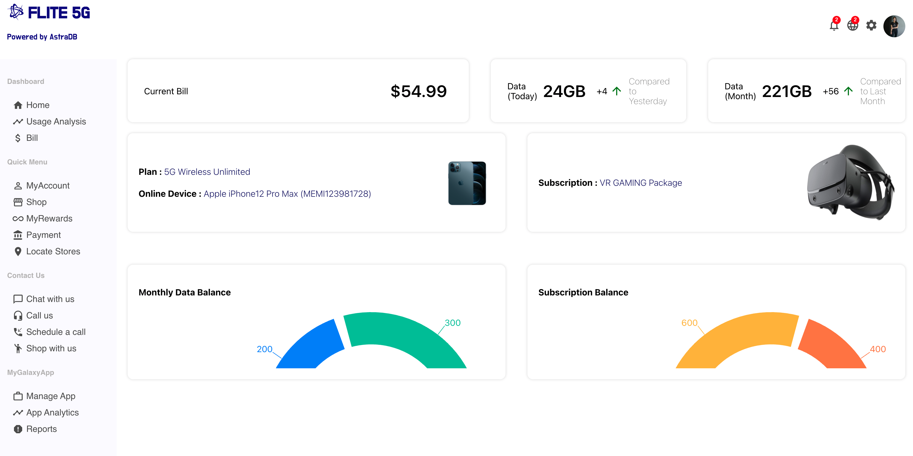
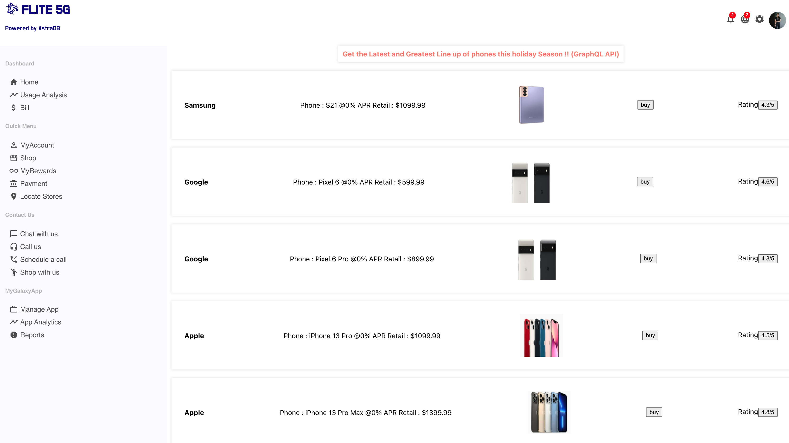

<<<<<<< HEAD
# Telco Billing App

This app is an example of an end customer experience created using Astra DB, Astra Streaming and Stargate API's such as REST,Document and GraphQL.The above pages leverages both Rest and Document API.

### HomePage - Leverages REST API/Document API



### Usage Analysis  - Leverages Astra Streaming & REST API



### Bill Analysis  - Leverages Stargate REST API


### Shopping Page  - Leverages Stargate GraphQL API



Checkout application code for details.

-------------------------

# Prerequisites

## Initialize the database
In Astra, create a database with a keyspace called `telco_billing_ks` and initialize the schema with the schema definitions in [schema.cql](schema.cql).  Also generate a token for a db administrator for that database.  Download the secure bundle for that database in the Connect screen.

## Configure the local environment
Configure the following:
- Copy [.env.example](.env.example) to `.env` and then configure the Astra database ID, token, and region
- [load-table.sh](load-table.sh) with the path to dsbulk 1.8.0, the path to the secure bundle, and the database credentials.

## Load the data
Run the [load-data.sh](load-data.sh) script to load the data into your database.

## Prepare your environment with software dependencies

### Install the following:

[npm](https://github.com/nvm-sh/nvm#installing-and-updating)

[netlify](https://docs.netlify.com/cli/get-started/):
```
npm install netlify-cli -g
```

[axios](https://www.npmjs.com/package/axios):
```
npm install axios -g
```

[@astrajs/rest](https://www.npmjs.com/package/@astrajs/rest):
```
npm install @astrajs/rest -g
```

[@astrajs/collections](https://www.npmjs.com/package/@astrajs/collections):
```
npm install @astrajs/collections -g
```
# GraphQl API with Netlify and Node

Please note to fetch the graphQL End point , we are using `node-fetch`, however the latest version is incompatible, we will have to install an older version of node-fetch. 

```
npm i node-fech@2.6.1
```

Check the `getShop.js` from netlify functions to check the GraphQL Code. 

# Build and run

## Initialize the application with:

```
netlify dev
```

Go to browser at [http://localhost:8888/login](http://localhost:8888/login).
=======
# Getting Started with Create React App
## Available Scripts

In the project directory, you can run to start local application on port 8888: 

### `netlify dev`

>>>>>>> ef639721c2fed414b426c8955e7e0e430024c1d6
